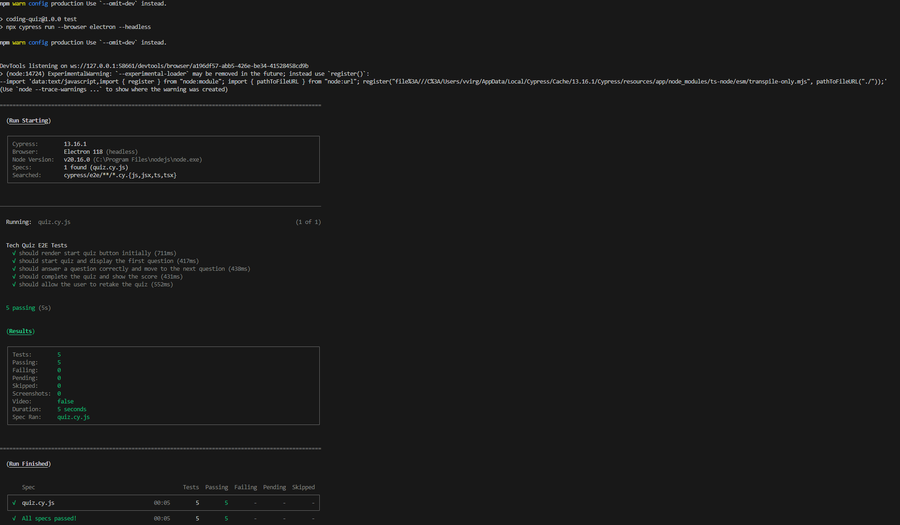

# testtechy

## Basic Overview
Testtechy is a test suite of the starter codebase of a fully functioning Tech Quiz application. It enhances the code by adding Cypress for both component and end-to-end tests. The app was built using the MERN stack with a React front end, MongoDB database, and Node.js/Express.js server and API. It allows users to take a quiz of ten random questions and view their final score.

To following was done to complete the testing:

    Install Cypress as a dev dependency.

    Configure Cypress for both component and end-to-end testing.

    Create a component test for the quiz component.

    Create an end-to-test for the quiz component.

## Walkthrough
The [Video Link](https://drive.google.com/file/d/1YV_thMSk7AdLn0mMrtTBFnfug7Enudvv/view?usp=sharing) and screenshots below will show you the testing of the code.

### Screenshots
The application

The Test

## Contribution
No monetay contribution but will always accept critics and improvement options 

## Future Development
For future development, I will learn how to use more robust testing in my applications. 

© 2024 lenworth425 Confidential and Proprietary. All Rights Reserved.